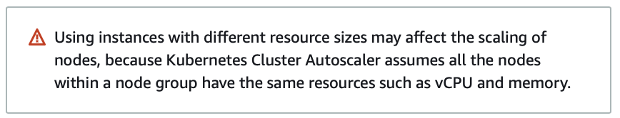

# Creating a Kubernetes cluster on AWS with EKSCTL

Creating a Kubernetes cluster on Amazon can seem to be a simple matter. Many methods and tools exist now to support and simplify this process, however most tools fall short when it comes to their support of an EKS cluster over time and through various upgrades in both the version of EKS and in replacing node groups with zero-downtime. The tools and method(s) I use and recommend can lift the burden and make your life easy. I'll share what and how in this article.

## Methods to create Kubernetes clusters

First, let's go over the options that I know off the top of my head of how to create and manage Kubernetes clusters on AWS.
You can:

* Set up your own self-managed Kubernetes cluster from scratch
* Use a tool called [KOPS](https://kops.sigs.k8s.io) to assist you in creating an self-managed AWS Cluster
* Use the [AWS Console](https://docs.aws.amazon.com/eks/latest/userguide/create-cluster.html) to create an AWS-managed cluster
* Use a [Terraform module](https://registry.terraform.io/modules/terraform-aws-modules/eks/aws/latest) to assist creating an AWS-managed Cluster
* Use an [Ansible module](https://docs.ansible.com/ansible/latest/collections/community/aws/aws_eks_cluster_module.html) to assist creating an AWS-managed Cluster
* Use a [Pulumi module](https://www.pulumi.com/registry/packages/aws/api-docs/eks/cluster/) to assist creating an AWS-managed Cluster
* Use [EKSCTL](http://eksctl.io), a tool co-authored by AWS and [WeaveWorks](https://www.weave.works)

Now lets discuss the options above and their upsides and downsides.

If you go with either of the self-managed options (the first two), you and your team are in for a lot of work and a lot of unnecessary tech debt. Self-managed Kubernetes clusters mean that you run and support the "master" nodes and you are responsible for more components and responsible for failover/redundancy. (for more info about master Kubernetes nodes and managing your own cluster [click here](https://www.techtarget.com/searchitoperations/tutorial/A-step-by-step-tutorial-for-Kubernetes-implementation)).

One of the core-tenets of successful DevOps is not taking on responsibility for something that you don't need to. So to succeed with that aim, we won't even consider or think about the first two further. However, I think it's important for any fellow professional to know what KOPS is, as this was "the way" to deploy Kubernetes before Amazon created EKS.

Next, is all the various methods to spin up an AWS managed EKS cluster. This includes manually via the AWS Console, or automatically with various set(s) of tools. The model I typically follow for my clients is to create everything via Terraform (eg: VPC, subnets, NAT Gateway, etc) EXCEPT for EKS; for which I use the tool Amazon helped co-author called EKSCTL. Generally, for good DevOps practice you NEVER want anything manually setup, and because EKSCTL only configures EKS you'd need some framework around where EKS will go into (eg: the VPC). However, if you're just starting/learning, maybe you are just trying to test out EKS, you might want to start with just letting EKSCTL create your VPC for you also.

## Why EKSCTL

It's important to understand WHY I have chosen to use and recommend EKSCTL over any other option.

EKS is a fairly complex beast to setup, and that setup changes over time. This is the ONE thing that I do not recommend setting up and managing via Terraform, but instead with a tool written by and recommended by AWS called [EKSCTL](https://eksctl.io/). For longer-term usage and support of EKS, I have encountered just about every issue you could imagine with every one of those methods above. The biggest problem with all of the other methods is that they don't manage the lifecycle of EKS. They don't "speak" EKS, and they don't understand how to manage and maintain an EKS cluster with zero-downtime over time. I've personally encountered issues with all other methods, which usually will only surface after you've been using them a while and need to perform version updates and/or node upgrades with zero-downtime. My current recommended path to success for EKS is EKSCTL from Amazon. I've successfully set up, maintained and upgraded more than 30 EKS clusters via EKSCTL over the last 3 years since I started using, and during/before that time I have struggled with supporting yet another 20+ EKS clusters via either the AWS Console directly, or via Terraform.

Largely, what happens a year down the road is you need to upgrade EKS. With EKSCTL, it's just a series of steps and commands to EKSCTL to perform zero-downtime rollouts of new node groups. The reason EKSCTL is better in this regard is it "speaks" to Kubernetes and manages the lifecycle of events. When you destroy a node group in Terraform, it would just go destroy an autoscaling group and kill the underlying nodes; causing pods to suddenly be forced off their node potentially causing downtime beause of the unexpected/unplanned nature of nodes being terminated. With EKSCTL, when you want to remove a node group, it goes into Kubernetes and one-at-a-time [cordons and drains the nodes](https://www.howtogeek.com/devops/cordons-and-drains-how-to-prepare-a-kubernetes-node-for-maintenance/) (which basically prepares your node for maintenance or removal) until all nodes from this autoscaler are drained, then it removes the nodes and then removes the autoscaler. This method of graceful incremental removal of nodes helps manage, reduce and eliminate downtime entirely (as long as you've configured your pods for high-scalability/redundancy).

This incremental node replacement strategy is part of something Amazon has a feature to help manage for you called [Managed node groups](https://docs.aws.amazon.com/eks/latest/userguide/managed-node-groups.html), and while you are welcome to use that and it is an adequate tool for some engineers, I personally don't recommend it. When you push off this concern to Amazon, you can find the removal of node groups to "stick" typically because of a [Pod Disruption Budget (or PDB)](https://www.elastic.co/guide/en/cloud-on-k8s/master/k8s-pod-disruption-budget.html). AWS managed node groups are a "black box", you don't really get feedback from it. EKSCTL effectively has the same feature-set built-into it that AWS Managed Node groups has, but with not being a black-box. When you use EKSCTL to manage this, you get full information and configurability regarding what is happening; and if there are any hiccups or if your removal of node groups gets "stuck", you'll know right away and you can manage the situation yourself to help ensure/guarantee minimal or zero-downtime during the process. This allows you the ability to, for example, go scale up a service suddenly so it lands on some of the other nodes, before then removing the pod(s) on the node you are trying to delete. This concept is not possible when you let AWS manage the node group replacement. Another thing I find useful to let EKSCTL manage your node groups instead of Amazon's Managed Node Groups, is that for non-production clusters where you can tolerate downtime, you can tell EKSCTL to aggressively replace node groups, often taking mere seconds to replace potentially all the nodes and node groups in your cluster, versus often taking 30+ minutes with AWS managed-node groups which don't offer any configurability/granularity on the aggressiveness of its actions.

**Sidenote**: If you're getting into Windows on EKS it's important to [understand the nuances and limitations of such, this page gets updated regularly as new features are released/improved.](https://docs.aws.amazon.com/eks/latest/userguide/windows-support.html). Also, if you'd like to look into and consider self-managed nodes feel free to read the documentation from AWS on [Launching self-managed Linux Worker Nodes](https://docs.aws.amazon.com/eks/latest/userguide/launch-workers.html) and [Launching self-managed Windows Worker Nodes](https://docs.aws.amazon.com/eks/latest/userguide/launch-windows-workers.html). Amazon also recently announced in December 2022 you [can now use Windows in Amazon's Managed Node Groups](https://aws.amazon.com/about-aws/whats-new/2022/12/amazon-eks-automated-provisioning-lifecycle-management-windows-containers/).


## Requirements / Setup

- [Install EKSCTL](https://docs.aws.amazon.com/eks/latest/userguide/eksctl.html)
- [Install AWS CLI](https://docs.aws.amazon.com/cli/latest/userguide/getting-started-install.html)
- [Install Kubectl CLI](https://kubernetes.io/docs/tasks/tools/)
- [Configure your AWS CLI to have access to your AWS Account](https://docs.aws.amazon.com/cli/latest/userguide/cli-configure-quickstart.html#cli-configure-quickstart-config)

## Get started making your cluster

You have really one of two options, you either pre-create (or use an existing) VPC on AWS, OR you let EKSCTL create that VPC.

For simplicity in this post we will be letting EKSCTL create an VPC. Using your favorite editor, just create a file named `basic-cluster.yaml` with the following contents:

```yaml
apiVersion: eksctl.io/v1alpha5
kind: ClusterConfig

metadata:
  name: basic-cluster
  region: us-east-1
  version: "1.23"
iam:
  withOIDC: true

nodeGroups:
  - name: ng-1
    availabilityZones: ["us-east-1a"]
    instanceType: m5.large
    desiredCapacity: 10
    volumeSize: 50
  - name: ng-2
    availabilityZones: ["us-east-1b"]
    instanceType: m5.xlarge
    desiredCapacity: 2
    volumeSize: 50
```

Of course, change the region, availability zones, and cluster name, and version if desired. Save this file, and then run the command:

```
eksctl create cluster --config-file basic-cluster.yaml
```

After running this command, it will begin provisioning your "infrastructure as code" EKSCTL config file in AWS. EKSCTL does this by creating some [CloudFormation](https://docs.aws.amazon.com/AWSCloudFormation/latest/UserGuide/Welcome.html) based on the configuration file. Once your cluster has been provisioned, it will then provision the node groups. After it finishes with the node groups, it'll setup your `kubectl` current context to be talking to the cluster, and it will exit.

At this point you should be able to query your Kubernetes cluster with the command

```bash
kubectl get nodes
```

If this works, congratulations! You've bootstrapped your own Kubernetes cluster on AWS via EKSCTL.


## Notes and nuances

It's important for me to convey certain best-practices to you:

- It is important that you ALWAYS ONLY put one node group in a single AZ. There is no strict requirements for this, however if you don't, when you use the [cluster-autoscaler](https://github.com/kubernetes/autoscaler/tree/master/cluster-autoscaler) to dynamically scale up the nodes in your cluster, it may "miss" when using AZ-specific resources (such as volumes, aka disks). This means if, for example, you want to start a stateful set such as a [Postgresql via Helm Chart](https://artifacthub.io/packages/helm/bitnami/postgresql) and you want it to be persistent. It will need to create a volume, and [volumes in AWS are bound to a single AZ](https://stackoverflow.com/questions/54469974/aws-any-way-to-have-cross-az-redundancy-with-ebs). On first provision it will work properly and randomly get located in whichever AZ it gets the pod assigned to. However, if that node dies or you need to restart this service, if there is no availability on the nodes in this AZ the autoscaler will try to scale up. The cluster autoscaler and how AWS's autoscaling groups work is that you can't specify which AZ to launch into. If you're in 2 AZ's, you have a 50% chance that the instance it launches is in the wrong AZ. If you're in 3 then a 66% chance, 4 AZ's a 75% chance, and so on. If you want the more highly-available and faster-to-scale system, you want to always stick to one AZ per node group.
- It's also critical that if you specify a "group" of instance types in one node group to launch, that you ensure they are of the same or similar resources. This strategy is REALLY useful with spot instance node groups. For example, using the instance types of `["c5a.2xlarge","c5ad.2xlarge","c5d.2xlarge","c5n.2xlarge","c5.2xlarge"]` would work great because all of them have the same CPU and RAM. However, it would be really bad if you instead used `["c5a.large","c5a.xlarge","c5d.2xlarge"]`. Because, similar to the above gotcha, cluster autoscaler can not "choose" which of these to launch, and it won't know exactly what it is provisioning. If you want to support many different instance types, they either need to have the same spec in one node group, or they each need to be their own node groups. If you make them their own node groups [cluster-autoscaler's scaling strategy, also called an Expander](https://github.com/kubernetes/autoscaler/blob/master/cluster-autoscaler/FAQ.md#what-are-expanders), can intelligently choose whichever it needs to handle your request based on its strategy. This means, same as above, your launch may "miss". So if for example you deployed a service which needs 6 CPUs and don't have that many available on any current nodes, it will trigger your autoscaling group to add one. However, with the configuration `["c5a.large","c5a.xlarge","c5d.2xlarge"]` you only have a (at best) 33% chance of launching an instance with enough CPUs, since `c5a.xlarge` has only 4 CPUs, and c5a.large has only 2.
  - Here's an excerpt from [AWS EKS Best-Practices](https://aws.github.io/aws-eks-best-practices/) - `It’s critical that all Instance Types have similar resource capacity when configuring Mixed Instance Policies. The autoscaler’s scheduling simulator uses the first InstanceType in the MixedInstancePolicy. If subsequent Instance Types are larger, resources may be wasted after a scale up. If smaller, your pods may fail to schedule on the new instances due to insufficient capacity. For example, M4, M5, M5a, and M5n instances all have similar amounts of CPU and Memory and are great candidates for a MixedInstancePolicy. The EC2 Instance Selector tool can help you identify similar instance types.`. Or see the image below from AWS's Console incase you attempt to do this improperly.

[](https://aws.github.io/aws-eks-best-practices/cluster-autoscaling/#spot-instances)

- The lessons I would have you take from the above about any of the Amazon Web Services is this platform won't stop you from doing really bad things (such as [allowing you to use an non-private CIDR range in your VPCs](https://docs.aws.amazon.com/vpc/latest/userguide/configure-your-vpc.html)). Doing these things will in the future when an experienced architected consults with you and your team will have to come in and redo your work. I **HIGHLY** recommend that EVERY engineer before setting up and managing Kubernetes on AWS reads and understand every part of the [EKS Best Practices Guide](https://aws.github.io/aws-eks-best-practices/).


## Thanks

Stay tuned for some of the follow-up articles on this regarding how to roll out new nodes, and on how to update Kubernetes versions with zero-downtime!

For much more useful and detailed EKSCTL configurations, I recommend viewing our companion Github repository with EKSCTL example configurations. This will fit much more advanced scenarios, spot instances, etc.

[https://github.com/DevOps-Nirvana/EKSCTL-Example-Configurations](https://github.com/DevOps-Nirvana/EKSCTL-Example-Configurations)
